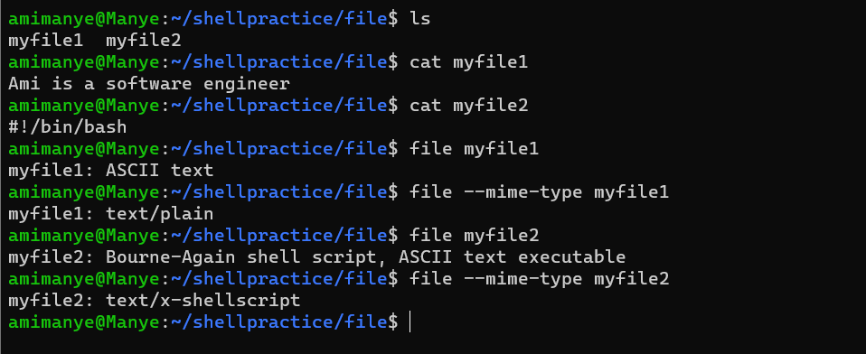
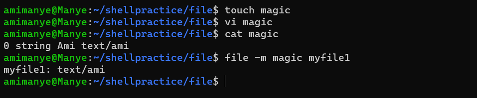
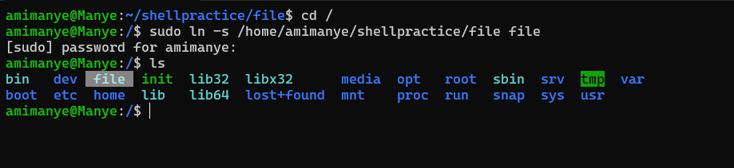

# Linux Navigation
## What is "the Shell"?
Simply put, the shell is a program that takes commands from the keyboard and gives them to the operating system to perform. Examplese: Bash (Bourne Again SHell), ksh, tcsh, zsh.

## What is a "Terminal"?
a program that opens a window and lets you interact with the shell.

## First 3 Linux commands
+ `pwd` : prints the current working directory
+ `cd` : changes directory
+ `ls` : lists files and directories

### `pwd`
The directory we are standing in is called the working directory. To see the name of the working directory, we use the pwd command.
+ When we first log on to our Linux system, the working directory is set to our home directory. 
+ This is where we put our files. 
+ On most systems, the home directory will be called `/home/user_name`

### `ls` 
+ To list the files in the working directory, we use the ls.


### `cd`
+ To change the working directory, we use the `cd` command. 
+ To do this, we type `cd` followed by the pathname of the desired working directory.

*PRACTISE-01*
+ change the working directory on your terminal to `usr/bin`
+ list the files and directoriesin the `usr/bin` directory.

## shortcuts
+ `cd` followed by nothing takes you to the home directory
+ `cd ~user_name` will also take you to the home directory.
+ `cd -` changes working directory to the previous directory you visited.

## File names facts
+ file names beginning with a dot, example .git are hidden. In order to get hidden files, we use the `-a` option of the `ls` command.
+ file names are case sensitive.


# Looking Around
## Popular options of ls command
+ `-l`: lists files in long format. this displays the file name, date modified, size of file in bytes, group, owner, file permissions. (will be discussed later)

## `less`
used to view content of text tiles
+ *syntax*: `less text_file` where `text_file` is the name of the file you want to view it's content.
+ the less command displays content of files one page at a time.
+ **Page Up or b**: scrolls back one page
+ **Page Down or space**: scrolls forward one page
+ **G**: goes to the end of the file
+ **1G**: goes to the beginning of the text file.
+ **/characters**: searches forward in the text file all the occurences of `characters` in `/characters`
+ **n**: repeat previous search
+ **h**: displays complete list less commands and options
+ **q**: quits the viewing of the file.

## `file`
used to determine what type of data a file contains, whether the file contains text, script among others

## `mime-type`
It is a string of text that represents the type and subtype of the data contained in a file.  
  
Consider this image below:  


**BONUS COMMAND**  
`cat`: the `cat` command is used to display the content of a file.  

Forexample: 
+ in my `~/shellpractice/file` directory, I have 2 files. 
+ `myfile1` contains plain text, "Ami is a software engineer"
+ `myfile2` contains a shell script, "#!/bin/bash" (*will talk more about shell scripts later in the course*)
+ the `file` command tells that the data contained in myfile1 is ASCII text while the data contained in `myfile2` is a shell script.

### How the file commands work
+ the file command looks at the contents of a file and checks it against a set of rules to figure out what type of file it is. 
+ these rules are stored in a file called the "magic" file (*you can file the exact location of the magic file using this command:* `file -v`)
+ By comparing the patterns and characteristics of the file to the rules in the "magic" file, the file command can tell you if it's an image, a text file, a compressed archive, or something else. 
+ It's like a detective that examines the file and uses clues to determine its type.

### the magic file
+ The magic file is typically used to define custom magic patterns and rules specific to your system or applications. 
+ It allows you to extend the default magic patterns provided by the file command. 
+ However, if you haven't added any customizations, the file may be empty.  

+ If you wish to customize the behavior of the file command or add your own magic rules, you can follow the format and guidelines described in the `magic(5)` man page. 
+ This allows you to define your own rules based on the file's content, such as identifying specific file formats or MIME types.  

### how to create custom file types a.k.a how to customize my magic file
+ since the `file` command uses rules stored in a magic file, we can create a magic file and define a rule.
+ Forexample, if we want all files starting with the word "Ami" to be identified as Ami text, instead of ASCII text and the mime type as `text/ami` instead of the default `text/plain`.
+ **Steps:**  
1. create a magic file 
2. define the rule in the magic file
3. save the magic file
4. test the file with the file command specifying the magic file created (use option `-m` to specify path to magic file)
5. `file` command should now identify the `myfile1` which begins with "Ami" as text/ami




## Let's take a tour
1. Navigate to the top-most directory of your linux system: `cd /` (called the `root`)
2. List all the files and directories in the root directory
3. Enter each directory one at a time: `cd directory_name`
4. List the files
5. If there is an interesting file, use the file command to determine its contents.
6. For text files, use `less` command to view them.

## Symbolic link
a symbolic link is a special kind of file that acts as a shortcut or pointer to another file or directory. you can create a symbolic link to a frequently accessed file and place it on your desktop or in a different folder for easier access.

### How to create a symbolic link
*syntax*: `ln -s /path/to/target/directory/or/file /path/to/symbolic/link`  
*Example:* let us create a symbolic link in `/` directory so that anytime we `cd` into the symbolic link, it takes us straight to `/home/amimanye/shellpractice/file`

+ **Steps**
1. Navigate to `/`
2. create symbolink
3. navigate to symbolink




# Manipulating files
## commands
+ `cp`: used to copy content of files
+ `mv`: used to move or rename files
+ `rm`: used to delete files and non empty directories
+ `mkdir`: used to create a directory

## wildcards
Wildcards are special characters that help you perform actions on multiple files or match patterns more flexibly.

### commonly used wildcards
1. **Asterisk (\*)**:  
It represents any number of characters (including zero characters) in a filename or pattern  
For example:

+ *.txt matches any file with a ".txt" extension.
+ file* matches any filename starting with "file".

2. **Question Mark (?)**: It represents a single character in a filename or pattern.  
For example:
+ f?le.txt matches files like "file.txt" or "fable.txt".

3. **Square Brackets** ([]): It represents a range or set of characters to match.  
For example:

+ [abc].txt matches files like "a.txt", "b.txt", or "c.txt".
+ [0-9].txt matches files like "1.txt", "9.txt", etc.

4. **Braces ({})**: It represents multiple options or alternatives.  
For example:

+ file{1,2,3}.txt matches files like "file1.txt", "file2.txt", or "file3.txt".

## `cp` command
The `cp` command is used in Unix-like operating systems to copy files and directories.  
It allows you to create a duplicate of a file or copy multiple files from one location to another.  
  
The basic syntax of the `cp` command is as follows:  

```bash
cp [options] source_file destination_file
```
  
Here are some commonly used options with the `cp` command:

+ `-r` or `-R`: Recursively copy directories and their contents.
+ `-i`: Prompt for confirmation before overwriting an existing file.
+ `-v`: Enable verbose output, displaying information about each file being copied.
+ `-p`: Preserve file attributes such as timestamps, permissions, and ownership during the copy.
+ `-u`: Copy only when the source file is newer than the destination file or when the destination file does not exist.  
  
Examples of using the cp command:

*Copy a file to another location:*
```bash
cp source_file destination_file
```

*Copy a directory and its contents recursively:*

```bash
cp -r source_directory destination_directory
```

*Copy multiple files to a directory:*

```bash
cp file1 file2 file3 destination_directory
```

*Copy a file, preserving its attributes:*

```bash
cp -p source_file destination_file
```
  
It's important to note that the `cp` command can overwrite files without warning, so use it with caution. To avoid accidental overwrites, you can use the `-i` option to prompt for confirmation.


## `mv` command

The mv command is used to move or rename files and directories in a command-line or terminal environment.  
It allows you to change the location or name of a file or directory within the file system.  

### syntax
```bash
mv [options] source destination
```
+ the `mv` command takes two arguments: the source and destination. 

### options
+ `-i` (interactive): Prompts for confirmation before overwriting an existing file.
+ `-f` (force): Forces the move or rename operation, overwriting any existing files without prompting.
+ `-v` (verbose): Prints detailed information about the files being moved.

+ Here's a simplified explanation of how the mv command works:
1. Moving a file: To move a file from one location to another, you specify the source file's current path and the destination path where you want to move the file. For example:

```bash
mv /path/to/source/file.txt /path/to/destination/
```

This command moves the file `file.txt` from its current location to the specified destination directory.

2. Renaming a file: To rename a file, you provide the current file path as the source and the new file name as the destination. For example:

```bash
mv /path/to/old/file.txt /path/to/new/filename.txt
```  

This command renames the file file.txt to filename.txt while keeping it in the same directory.

3. Moving and renaming directories: The mv command can also be used to move and rename directories. The syntax is similar to moving or renaming files. For example:

```bash
mv /path/to/source/directory /path/to/destination/newname
```

This command moves the entire directory to the specified destination and renames it to newname.


## `rm` command
+ The rm command is used to remove or delete files and directories. 
+ It stands for "remove." 
+ The rm command can be powerful and should be used with caution because it permanently deletes files and directories, bypassing the trash or recycle bin.  
  
*The basic syntax of the rm command is:*

```bash
rm [options] file1 file2 ...
```  
where file1, file2, and so on represent the names of the files or directories you want to remove.  
  

Here are some commonly used options with the rm command:

+ `-r` or `-R`: Recursively removes directories and their contents. Use this option when deleting directories.
+ `-f`: Forces the removal of files without prompting for confirmation, even if the files are write-protected or the user does not have sufficient permissions.
+ `-i`: Interactive mode prompts for confirmation before removing each file.
+ `-v`: Verbose mode displays detailed information about the files being removed.

Examples:

1. To remove a single file:

```bash
rm filename.txt
```

2. To remove multiple files:

```bash
rm file1.txt file2.txt file3.txt
```

3. To remove a directory and its contents recursively:

```bash
rm -r directoryname
```

4. To remove files interactively with confirmation prompts:

```bash
rm -i file1.txt file2.txt
```


## `mkdir` command
+ The mkdir command is used to create directories (folders) in a file system. 
+ It stands for "make directory."  
  
Here's how you can use the mkdir command and its basic implementation:

```bash
mkdir [options] directory_name
```  

`[options] (optional)`: You can use various options with the `mkdir` command to modify its behavior. Some common options include:  

+ `-p or --parents`: Create parent directories if they don't exist.
+ `-m or --mode`: Set the permissions for the created directory.
+ `-v or --verbose`: Display a message for each created directory.
  
There may be additional options depending on your operating system.
+ `directory_name`: Specify the name and location of the directory you want to create. 
+ If you provide a relative path, the directory will be created relative to your current working directory. 
+ If you provide an absolute path, the directory will be created at the specified location.

### Relative and absolute path
1. **Relative Path**: A relative path specifies the location of a file or directory relative to your current working directory. It is like giving directions based on your current position. Think of it as navigating through directories using landmarks or directions. For example:

+ If you are currently in the "Documents" folder, a relative path like "Pictures/photo.jpg" would refer to the file "photo.jpg" inside the "Pictures" folder relative to your current location.
+ The relative path doesn't start with a slash ("/") and is based on your current position.

2. **Absolute Path**: An absolute path specifies the complete and exact location of a file or directory from the root of the file system. It provides the full path starting from the root directory, regardless of your current working directory. It's like specifying the address of a location without any reference to your current position. For example:

+ An absolute path like "/home/user/Documents/file.txt" would point directly to the file "file.txt" in the "Documents" folder, regardless of where you are currently located in the file system.
The absolute path always starts with a slash ("/") and gives the full path from the root directory.

Here are a few examples of using the mkdir command:

1. Create a directory named "`my_directory`" in the current working directory:

```bash
mkdir my_directory
```

2. Create a directory named "`my_directory`" with verbose output:

```bash
mkdir -v my_directory
```

3. Create nested directories "parent/child/grandchild":

```bash
mkdir -p parent/child/grandchild
```
4. Create a directory with specific permissions:
```bash
mkdir -m 755 my_directory
```
